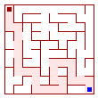

# maze

Maze algorithms from the book [Mazes for Programmers](https://pragprog.com/book/jbmaze/mazes-for-programmers) translated to Go.

Translated algorithms:

- Aldous Broder
- Binary Tree
- Sidewinder
- Wilson

## Samples

The first sample creates a 10x10 maze with the [Aldous Broder Algorithm](http://weblog.jamisbuck.org/2011/1/17/maze-generation-aldous-broder-algorithm) and print out the result:

``` go
// maze_to_ascii.go

package main

import (
	"fmt"

	"github.com/ehehalt/maze"
)

func main() {
	g := maze.NewGrid(10, 10)
	g = maze.AldousBroder(*g)
	ascii := g.ToString()
	fmt.Println(ascii)
}
```

In the second sample the 10x10 maze would exported as png. It's a Aldous Broder too:

``` go
// maze_to_png.go

package main

import "github.com/ehehalt/maze"

func main() {
	g := maze.NewGrid(10, 10)
	g = maze.AldousBroder(*g)
	maze.GridToPng(g, "maze.png", true, true)
}

```

The result looks like


